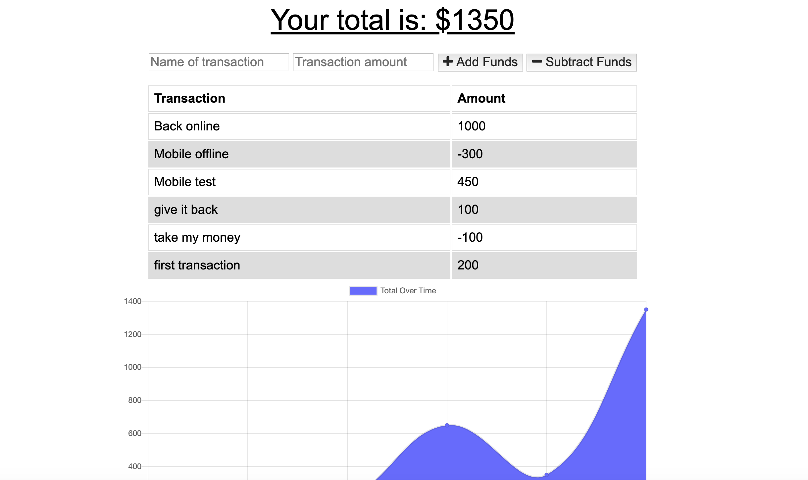
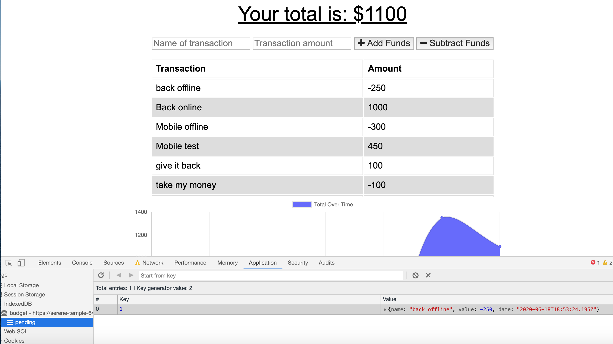
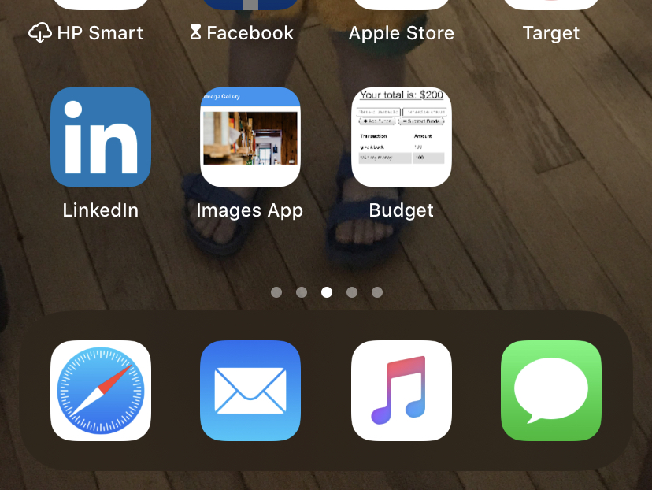

# Budget Tracker

### **by Roger Pouncey** 

The Budget Tracker is a progressive web app (PWA) that can be used to track your budget both on- and offline. 

Email: rpounceyjr@gmail.com

## **Table of Contents** 

#### i. [Installation](#installation)

#### ii. [Usage](#usage)

#### iii. [Contributing](#contributing)

#### iv. [Tests](#tests)

#### v. [Questions](#questions)

## **Installation** 
 
                $ npm i

## **Usage** 

Budget Tracker allows the user to create and save transactions.  Users create a transaction name and amount, and specify whether the transaction is a deposit or withdrawal.  With an online connection, the transaction is immediately stored as a document in a MongoDB database.  Without a connection, the transaction is stored in IndexedDB.  A listener on the window object in the db.js file listens for an online connection and sends the information from the IndexedDB object store to the database when the app regains a connection.

Along with the ability to store transactions offline, the webmanifest also provides the information necessary to save the Budget Tracker as a stand-alone app.  The app can be downloaded on mobile devices and functions just as it does in the browser.

## **Contributing** 

This project was created by Roger Pouncey.  Improvements can be made to the app by making a pull request on GitHub.

## **Tests** 

No tests were performed on this app.

## **Questions** 

Questions about this app can be addressed to Roger Pouncey, either through GitHub or via the above email address.